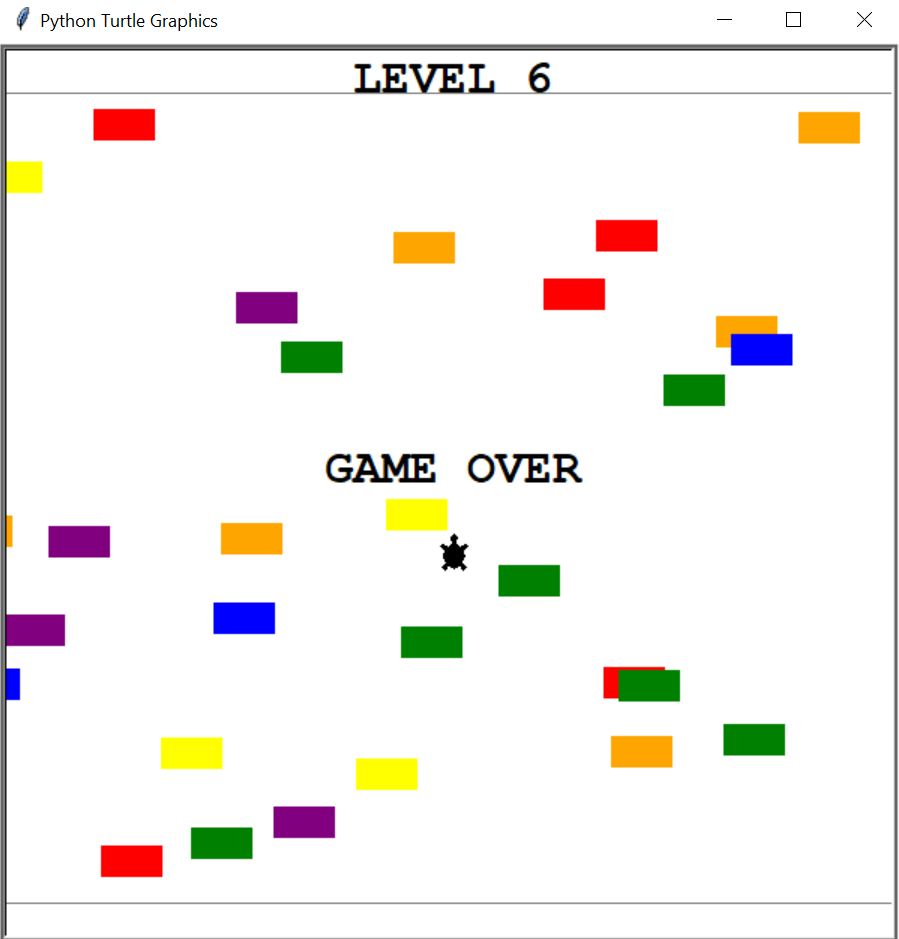

# Python_projects

Some python projects i code in [100-days-code-bootcamp](https://www.udemy.com/course/100-days-of-code/) (by Angela Yu) and more

...
   
   

### **Blackjack** - day 11 

Blackjack with infinite deck.

\~~~

### **Hirst's Dots & Spirograf** - day 18

Using _colorgram.py_ and _turtle_ packages, made colorful circles and a similar of Hirst's famous dot paintings.

\~~~

### **Rainbow Turtle Race** - day 19

I used turtle graphics to create rainbow-color turtles and put them on a randomized pace race.

\~~~

### **Snake Game** - day 20-21

I used turtle graphics to code the legendary *SNAKE GAME*.
#### RULES:
* if you crash into snakes, game over
* if you crash to the boundaries, game over

\~~~

### **Pong Game** - day 22

I used turtle module to code the legendary arcade game *PONG*.
#### RULES:
* Right control: Up and Down keys
* Left control: "w" and "s" keys (both lowercase)
* with each bounce, ball's speed increase
* game ends when a player reach 5 (can be change in ehile loop in the main.py)

\~~~

### **Turtle Cross** - day 23

I used turtle module to create a turtle crossing game.

#### Rules:
* Turtle can only move forward
* Cars' speed increases as level increases 

